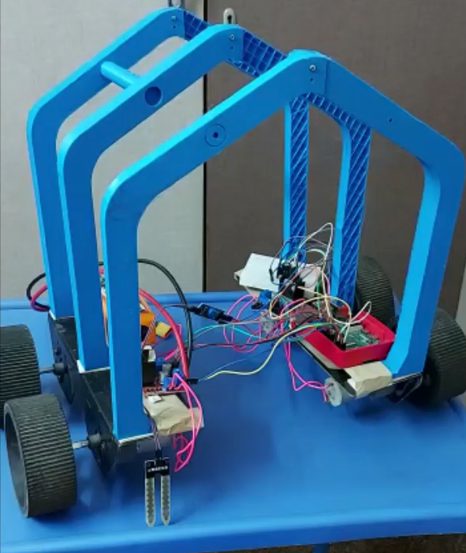

# 🌾 Agricultural Monitoring Rover

> A teleoperated agricultural monitoring robot with an innovative arch-shaped chassis designed for non-disruptive crop navigation, integrating soil moisture and environmental sensors with IoT connectivity for remote data collection.

**Anna University | Dec 2021 – Mar 2022**

---

## 📸 Gallery

<p align="center">
  
  <br><em>Physical prototype — arch-shaped 3D-printed chassis straddling crop rows, with Raspberry Pi, L298N motor driver, soil moisture sensor, and humidity sensor integrated on the chassis platform</em>
</p>

---

## 📖 Overview

Traditional agricultural monitoring methods require manual inspection of crop fields, which is time-consuming, labor-intensive, and often disruptive to crops. This project addresses that challenge with a purpose-built mobile robot designed to navigate between crop rows without disturbing plants, while continuously collecting soil and environmental data and transmitting it remotely via IoT.

The rover's key innovation is its **arch-shaped chassis** — inspired by the geometry of crop row spacing — allowing the robot to straddle plants and move along rows without physical contact. The project was recognized at a university ideathon for its novel mechanical design approach.

---

## ✨ Key Features

- **Arch-shaped chassis** — novel design that allows the rover to navigate over crops without damaging them
- **3D-printed structure** — chassis modeled in Fusion 360 and fabricated through 3D printing combined with a metal base
- **Soil moisture sensing** — real-time measurement of soil moisture levels at ground contact
- **Environmental humidity sensing** — ambient humidity monitoring across the field
- **IoT connectivity** — sensor data transmitted remotely for off-site monitoring and analysis
- **Teleoperated control** — Raspberry Pi + L298N motor driver enabling remote driving
- **Modular sensor integration** — expandable platform for additional sensors

---

## 🏗️ System Architecture

```
┌─────────────────────────────────────────────────────┐
│                Remote Operator                      │
│         (Monitor sensor data via IoT)               │
└──────────────────────┬──────────────────────────────┘
                       │ IoT / WiFi
┌──────────────────────▼──────────────────────────────┐
│               Raspberry Pi (Controller)             │
│     - Teleoperation motor control algorithms        │
│     - Sensor data acquisition & processing          │
│     - IoT data transmission                         │
└──────────┬───────────────────────┬──────────────────┘
           │ Motor Commands        │ Sensor Readings
┌──────────▼──────────┐  ┌─────────▼────────────────┐
│   L298N Motor Driver│  │   Sensor Suite           │
│   (Differential     │  │   - Soil Moisture Sensor │
│    drive control)   │  │   - Humidity Sensor      │
└──────────┬──────────┘  └──────────────────────────┘
           │
┌──────────▼──────────────────────────────────────────┐
│              Arch-Shaped Rover Chassis              │
│     (3D-printed PLA arch + metal base + wheels)     │
└─────────────────────────────────────────────────────┘
```

---

## 🔧 Hardware Components

| Component | Description |
|-----------|-------------|
| **Controller** | Raspberry Pi |
| **Motor Driver** | L298N dual H-bridge motor driver |
| **Drive System** | DC motors with differential drive |
| **Soil Sensor** | Soil moisture sensor (resistive probe) |
| **Environment Sensor** | Humidity sensor |
| **Chassis** | 3D-printed PLA arch structure + metal base |
| **Connectivity** | WiFi (IoT data transmission) |
| **Design Tool** | Fusion 360 (chassis CAD modeling) |

---

## 💻 Software Stack

| Layer | Technology |
|-------|-----------|
| **Controller** | Raspberry Pi (Python) |
| **Motor Control** | GPIO-based L298N driver algorithms |
| **Sensor Interface** | GPIO / ADC sensor reading |
| **IoT Transmission** | WiFi-based remote data logging |
| **CAD Design** | Fusion 360 |

---

## 🌱 Chassis Design — Key Innovation

The arch-shaped chassis is the defining feature of this rover. Conventional wheeled robots would crush or displace plants when navigating through dense crop rows. This design solves that by:

- **Straddling crop rows** — the arch spans the width of a crop row, keeping all mechanical components above the plant canopy
- **Low ground clearance at the base** — sensor probes (soil moisture) can reach ground level while the chassis clears the plants
- **Stable 4-wheel platform** — metal base provides structural rigidity and low center of gravity despite the elevated arch
- **Scalable arch width** — design parameterized in Fusion 360 for adaptation to different crop row spacings

---

## 📡 Sensor & IoT System

**Soil Moisture Sensor**
- Resistive probe inserted into soil as the rover traverses rows
- Analog readings processed by Raspberry Pi
- Data logged with timestamp and GPS-approximate position

**Humidity Sensor**
- Measures ambient environmental humidity above the crop canopy
- Useful for detecting microclimatic variations across the field
- Data streamed in real-time alongside soil data

**IoT Connectivity**
- Raspberry Pi transmits collected sensor data over WiFi
- Remote dashboard enables farmers to monitor field conditions without physical inspection
- Lays foundation for autonomous data-driven irrigation or intervention triggers

---

## 📊 Results & Recognition

| Metric | Result |
|--------|--------|
| Chassis design approach | Novel arch-shaped — non-disruptive crop navigation |
| Sensors integrated | Soil moisture + environmental humidity |
| Control mode | Teleoperated (Raspberry Pi + L298N) |
| Connectivity | IoT (WiFi-based remote monitoring) |
| Recognition | **Presented at university ideathon — recognized for innovative mechanical design** |

---

## 🚀 Getting Started

### Requirements

```
Raspberry Pi (any model with GPIO)
Python 3.x
RPi.GPIO library
L298N motor driver module
Soil moisture sensor
Humidity sensor (DHT11 / DHT22)
WiFi connectivity
```

### Installation

```bash
git clone https://github.com/<your-username>/agricultural-monitoring-rover.git
cd agricultural-monitoring-rover
pip install -r requirements.txt
```

### Running the Rover

```python
# Start teleoperation and sensor logging
python main.py
```

The system will initialize motor control, begin reading sensor data, and start transmitting to the configured IoT endpoint.

---

## 📁 Repository Structure

```
agricultural-monitoring-rover/
├── images/
│   └── agricultural_monitoring_system_project_photo.png
├── firmware/
│   ├── motor_control.py          # L298N teleoperation control
│   ├── sensor_reader.py          # Soil moisture + humidity data acquisition
│   └── iot_transmitter.py        # Remote data transmission
├── hardware/
│   └── cad/                      # Fusion 360 chassis STL files
├── main.py
├── requirements.txt
└── README.md
```

---

## 🔭 Future Work

- **Autonomous navigation** — upgrade from teleoperation to autonomous row-following using line detection or GPS waypoints
- **Additional sensors** — NPK (nitrogen, phosphorus, potassium) soil nutrient sensors, temperature probes
- **Data analytics dashboard** — web-based visualization of field sensor maps over time
- **Solar power** — integrate solar panel on the arch top for extended field operation

---

## 👤 Author

**Ahilesh V** — Robotics Engineering, Northeastern University
- Designed novel arch-shaped chassis concept in Fusion 360
- Fabricated prototype through 3D printing and metal base assembly
- Integrated Raspberry Pi with L298N motor driver for teleoperated control
- Developed sensor integration system with IoT connectivity
- Presented at university ideathon

---

## 📄 License

This project is open source and available under the [MIT License](LICENSE).

---

*Built as an undergraduate robotics project at Anna University (Dec 2021 – Mar 2022)*
